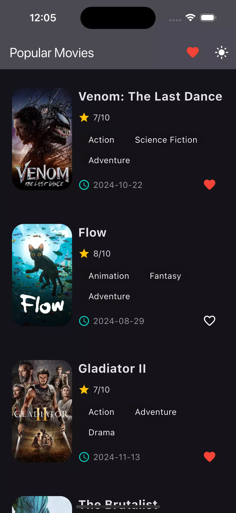

# Movies App - BLoC State Management (Flutter)

## About
Multi-platform movies application built with **Flutter**. This Mobile App utilizes a wide range of features, including, **MVVM Architectural Pattern**, **BLoC for State Management**, **GetIt**, , **RESTful APIs**, and more.

Here you can see a real list of the movies, fetched from the server and see more details.

  

## Note
This is just an exercise and not a real publishable app.